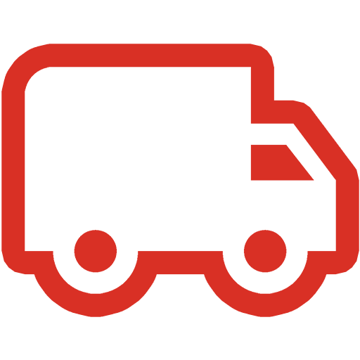

  

  <h3 align="center">
    <a href="https://packagesforgmail.com/">[WIP] Packages for Gmail</a>
  </h3>

  

    All your packages in one place.
  

<!-- TABLE OF CONTENTS -->

  
Table of Contents

  <ol>
    <li>
      <a href="#about">About</a>
      <ul>
        <li><a href="#code-examples">Code Examples</a></li>
        <li><a href="#features">Features</a></li>
        <li><a href="#built-with">Built With</a></li>
      </ul>
    </li>
    <li><a href="#acknowledgements">Acknowledgements</a></li>
    <li><a href="#gallery">Gallery</a></li>
  </ol>

<!-- ABOUT -->

## About

[![Screen Shot][product-screenshot]](https://packagesforgmail.com/)

Work in progress. Tracking your online orders shouldn't be difficult. That's where the Packages for Gmail Chrome Extension comes in. It beautifully displays all of your incoming packages right inside your Gmail inbox. Connects with [Packages for Gmail Back-End](https://github.com/anatelli10/packages-for-gmail-back-end) for authentication and package tracking number detection.

#### Code Examples
-   [pages/content/index.js](https://github.com/anatelli10/packages-for-gmail/tree/main/src/pages/content/index.js)
-   [pages/content/modules/authorizedFetch.js](https://github.com/anatelli10/packages-for-gmail/blob/main/src/pages/content/modules/authorizedFetch.js)
-   [pages/content/components/Packages.jsx](https://github.com/anatelli10/packages-for-gmail/blob/main/src/pages/content/components/Packages.jsx)
-   [pages/content/components/PackagesTable.jsx](https://github.com/anatelli10/packages-for-gmail/blob/main/src/pages/content/components/table/PackagesTable.jsx)
-   [pages/content/components/PackagesTableRow.jsx](https://github.com/anatelli10/packages-for-gmail/blob/main/src/pages/content/components/table/PackagesTableRow.jsx)
-   [pages/content/components/Buttons/AddButton.jsx](https://github.com/anatelli10/packages-for-gmail/blob/main/src/pages/content/components/buttons/AddButton.jsx)
-   [pages/content/components/Buttons/FilterButton.jsx](https://github.com/anatelli10/packages-for-gmail/blob/main/src/pages/content/components/buttons/FilterButton.jsx)

#### Features

-   Supports FedEx, UPS, and USPS packages
-   View the sender, package status, delivery (or estimated delivery) time, message time, and tracking number of each package
-   Sort
-   Filter
-   Search
-   View the last package tracking history update description
-   View the message the package is from
-   View the full package tracking history on the courier's site
-   Manually add or delete packages
-   Download package(s) data into a .csv file

#### Built With

-   [React](https://reactjs.org/)
-   [Material-UI](https://material-ui.com/)
-   [Chrome API](https://developer.chrome.com/docs/extensions/reference/)
-   [InboxSDK](https://www.inboxsdk.com/)

<!-- ACKNOWLEDGEMENTS -->

## Acknowledgements

-   [TS Tracking Number](https://github.com/rjbrooksjr/ts-tracking-number)
-   [Chrome Extension Boilerplate](https://github.com/lxieyang/chrome-extension-boilerplate-react)
-   [use-chrome-storage](https://github.com/onikienko/use-chrome-storage)
-   [File Saver](https://github.com/eligrey/FileSaver.js)
-   [Notistack](https://github.com/iamhosseindhv/notistack)
-   [react-google-button](https://github.com/prescottprue/react-google-button)
-   [React Image](https://github.com/mbrevda/react-image)
-   [Best-README-Template](https://github.com/othneildrew/Best-README-Template)

## Gallery
![Screen Shot][product-screenshot-1]
![Screen Shot][product-screenshot-2]
![Screen Shot][product-screenshot-3]
![Screen Shot][product-screenshot-4]
![Screen Shot][product-screenshot-5]
![Screen Shot][product-screenshot-6]
![Screen Shot][product-screenshot-7]
![Screen Shot][product-screenshot-8]
![Screen Shot][product-screenshot-9]

[product-screenshot]: https://i.imgur.com/jskv0vs.png
[product-screenshot-1]: https://i.imgur.com/G45U1ah.png
[product-screenshot-2]: https://i.imgur.com/9ep3Rgc.png
[product-screenshot-3]: https://i.imgur.com/S0E9B4M.png
[product-screenshot-4]: https://i.imgur.com/DotgCDd.png
[product-screenshot-5]: https://i.imgur.com/ibXVQCT.png
[product-screenshot-6]: https://i.imgur.com/JN1vJrK.png
[product-screenshot-7]: https://i.imgur.com/5wc2oMM.png
[product-screenshot-8]: https://i.imgur.com/eSgQoZj.png
[product-screenshot-9]: https://i.imgur.com/lm6YPBW.png
